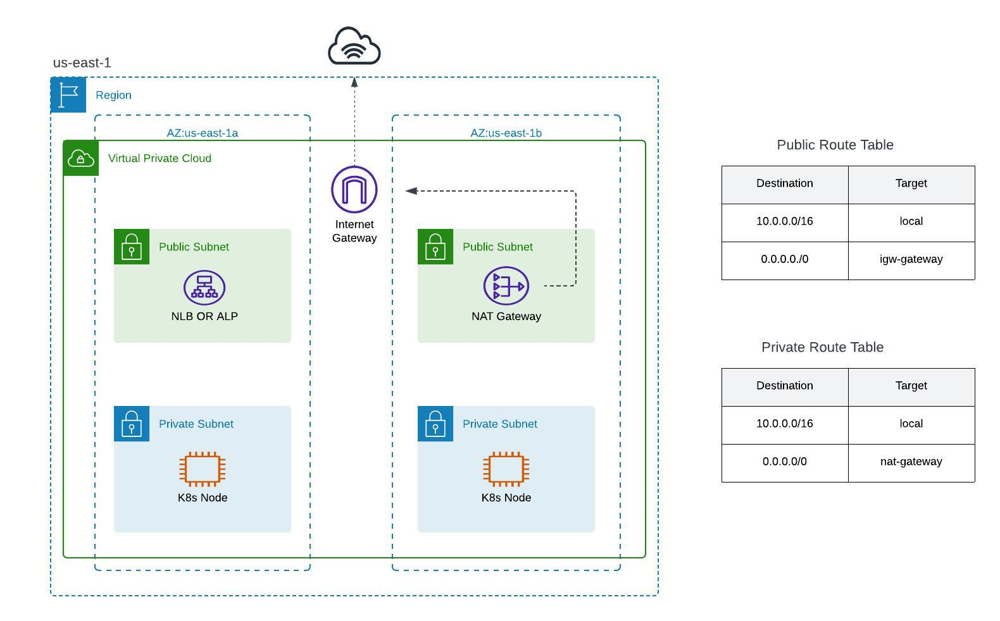

# EKS Cluster Deployment in AWS

This repository contains resources for deploying an Elastic Kubernetes Service (EKS) cluster in AWS using Terraform, Kubernetes manifests, and Dockerized applications. It is a comprehensive, end-to-end project designed to demonstrate infrastructure as code (IaC), Kubernetes management, and application deployment.

## Project Overview
This project includes:

- **_Kubernetes manifests_** for various roles, controllers, autoscaling, and ingress management

- **_Terraform scripts_** to automate the setup of the AWS infrastructure for EKS and additional services.

- **_A Python "to-do" app_** running in a containerized environment, showcasing CI/CD workflows.




## Features: 
- Secure infrastructure with IAM roles and OIDC provider setup.
- Highly available Kubernetes cluster with autoscaling.
- Ingress controllers for HTTP and HTTPS traffic.
- Cert-manager for certificate management.
- Persistent storage using EBS.
- Helm-based application deployments.
- Automated CI/CD pipeline using GitHub workflows.
---

## Repository Structure
#### Kubernetes Manifests
The Kubernetes manifests directory contains examples for different approaches to cluster management and application scaling:

- 1- **Viewer Cluster Role** – Define a read-only access role.
- 2- **Admin Cluster Role** – Full administrative access for cluster resources.
- 3- **HPA (Horizontal Pod Autoscaler)** – Example for auto-scaling pods based on resource usage.
- 4- **Cluster Autoscaler** – Automatically adjust the number of nodes in the cluster.
- 5- **Service LoadBalancer** – Expose services using AWS NLB/ALB.
- 6- **HTTP Ingress** – Handle HTTP traffic to services.
- 7- **HTTPS Ingress** – Secure traffic with HTTPS.
- 8- **Nginx Controller** – Manage ingress traffic using Nginx.
- 9- **Cert-Manager** – Manage SSL certificates.
- 10- **CSI (Container Storage Interface)** – Handle storage volumes for Kubernetes.

#### Terraform Directory
The Terraform directory consists of various scripts to provision AWS infrastructure and manage Kubernetes resources.

- **iam/** – IAM roles and permissions for EKS and other components.
- **values/** – Custom values for different configurations.
- 0-`locals.tf` – Local variables.
- 1-`providers.tf` – Provider configurations for AWS and Helm.
- 2-`vpc.tf` – Virtual Private Cloud setup.
- 3-`igw.tf` – Internet Gateway configuration.
- 4-`subnets.tf` – Public and private subnets.
- 5-`nat.tf` – NAT gateway for internet access to private subnets.
- 6-`routes.tf` – Route tables for VPC traffic.
- 7-`eks.tf` – EKS cluster configuration.
- 8-`nodes.tf` – Worker nodes configuration.

**Other files**– Additional configurations for autoscalers, ingress controllers, metrics server, cert-manager, CSI drivers, and more.

#### Python App
This directory contains a simple to-do application written in Python, deployed as a container in the EKS cluster.

- `app.py` – Main application logic.
- `templates/index.html` – Frontend template for the to-do list.
- `requirements.txt` – Python dependencies.

 `.env `– Environment variables for the app.

 `dockerfile` – Docker image creation.

 `docker-compose.yaml` – Multi-container setup with Docker Compose.

`init-db.sql` – Script to initialize the database.

`script.sh` – Commands to build the app image and to run the app.

#### GitHub Workflows
- **Docker Image CI** – A CI/CD workflow that builds and pushes the Docker image for the to-do app on every push.
---

## How to Run the Project

1. Clone the repository:

```bash 
git clone https://github.com/
cd your-repo
```

2. Terraform Infrastructure:

```bash
cd terraform
terraform init
terraform apply
```
This will provision the necessary AWS infrastructure, including the EKS cluster, subnets, and IAM roles.

3. Deploy Kubernetes Manifests:

```bash
cd manifests
kubectl apply -f .
```

4. Run the Python App:

```bash
cd app
docker build -t todo-app-image .
docker-compose up --build
```
The to-do app will run in a container and can be accessed at `http://localhost:5000`.

---

## Conclusion
This project demonstrates the deployment of a highly scalable and secure EKS cluster on AWS, including automated provisioning of infrastructure, Kubernetes management, and CI/CD for a Dockerized application. Feel free to explore the repository and modify it as needed for your use case.

